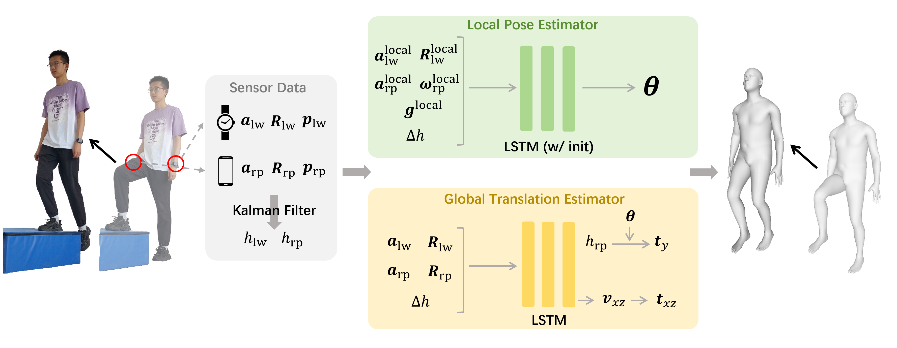
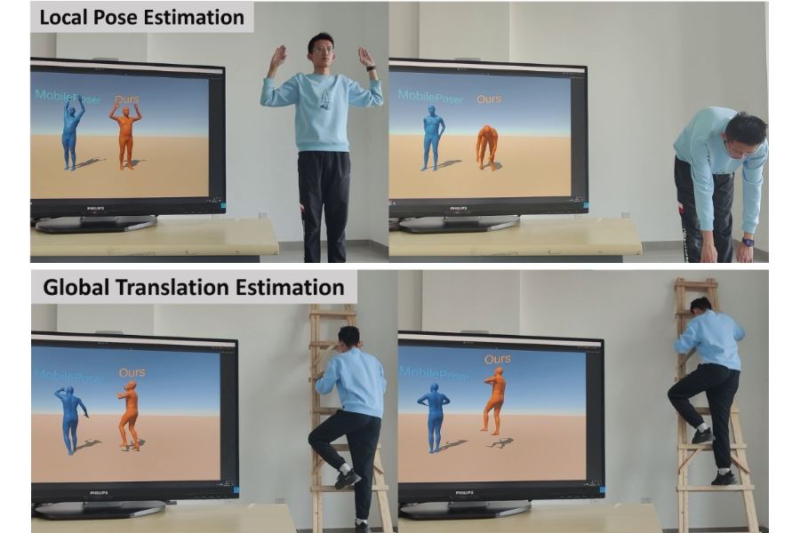

<div align="center">
<h2>BaroPoser: Real-time Human Motion Tracking from IMUs and Barometers in Everyday Devices</h2>

[**Libo Zhang**](https://zhanglbthu.github.io/) · [**Xinyu Yi**](https://xinyu-yi.github.io/) · [**Feng Xu**](http://xufeng.site/)

Tsinghua University

</div>

### [Paper](https://www.arxiv.org/abs/2508.03313)
Code for paper "BaroPoser: Real-time Human Motion Tracking from IMUs and Barometers in Everyday Devices", which is accepted by UIST 2025.

### Pipeline
<div align="center">
    
</div>

### Results

<div align="center">
    
</div>


## Usage

### Setup

```bash
git clone git@github.com:zhanglbthu/BaroPoser.git
cd BaroPoser
conda create -n baroposer python=3.9.20
conda activate baroposer
pip install -r requirements.txt
```

### Data Preparation
Coming soon.
### Train
<!-- You can download our trained model from [here](https://drive.google.com/drive/folders/1g4r1g_39yXL071Co9uQ7fgqEPaHgfO8B?usp=drive_link).
You can also train your own model by following the steps below:

First, modify the training configuration file `config/optimize.ini` to fit your own dataset. -->

### Evaluate
